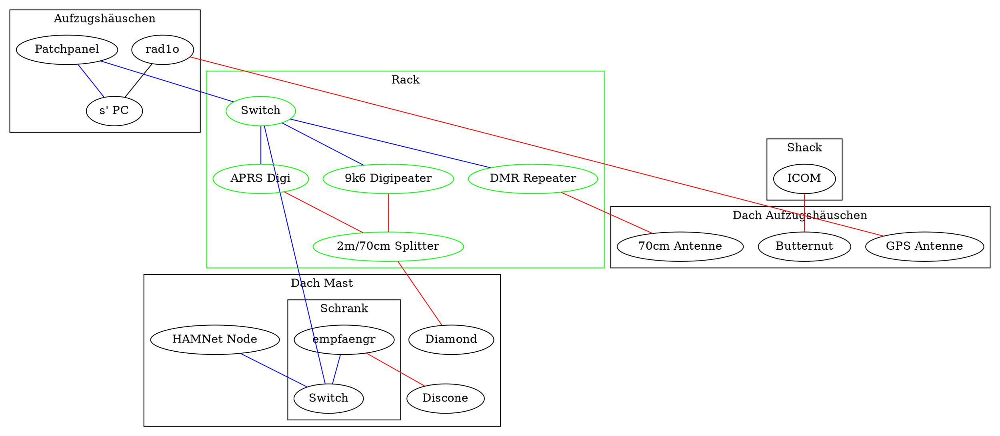

# DL0MUC

## Logische Ansicht

Planung Stand 23.03.2018

```graphviz
    graph {
        splines=line;

        subgraph cluster_dach_mast {
            label="Dach Mast";
            node [label="Diamond"] ant_diamond;
            node [label="Discone"] ant_discone;
            node [label="HAMNet Node"] ant_hamnet;

            subgraph cluster_schrank {
                label="Schrank";

                node [label="empfaengr"] empfaengr;
                node [label="Switch"] eth_switch_mast;
            }
        }

        subgraph cluster_dach_aufzugshaeuschen {
            label="Dach Aufzugshäuschen";

            node [label="Butternut"] ant_butternut;
            node [label="GPS Antenne"] ant_sat;
            node [label="70cm Antenne"] ant_70cm;
        }

        subgraph cluster_rack {
            label="Rack";
            color=green;
            node [color=green,label="Switch"] eth_switch_rack;
            node [color=green,label="APRS Digi"] aprs_digi;
            node [color=green,label="9k6 Digipeater"] digi_9k6;
            node [color=green,label="DMR Repeater"] dmr_repeater;

            node [color=green,label="2m/70cm Splitter"] splitter_2m70cm;
        }

        subgraph cluster_aufzug {
            label="Aufzugshäuschen";
            node [label="s' PC"] s_pc;
            node [label="rad1o"] rad1o;
            node [label="Patchpanel"] eth_patchpanel;
            rad1o -- s_pc;
        }

        subgraph cluster_shack {
            label="Shack";
            rank="sink";
            node [label="ICOM"] trx_icom;
        }

        empfaengr -- ant_discone [color="red"];

        trx_icom -- ant_butternut [color="red"];
        rad1o -- ant_sat [color="red"];
        ant_hamnet -- eth_switch_mast [color="blue"];
        empfaengr -- eth_switch_mast [color="blue"];

        aprs_digi -- splitter_2m70cm [color="red"];
        digi_9k6 -- splitter_2m70cm [color="red"];
        splitter_2m70cm -- ant_diamond [color="red"];

        dmr_repeater -- ant_70cm [color="red"];

        eth_switch_rack -- aprs_digi [color="blue"];
        eth_switch_rack -- eth_switch_mast [color="blue"];
        eth_switch_rack -- dmr_repeater [color="blue"];
        eth_switch_rack -- digi_9k6 [color="blue"];

        eth_patchpanel -- s_pc [color="blue"];
        eth_patchpanel -- eth_switch_rack [color="blue"];
    }
```