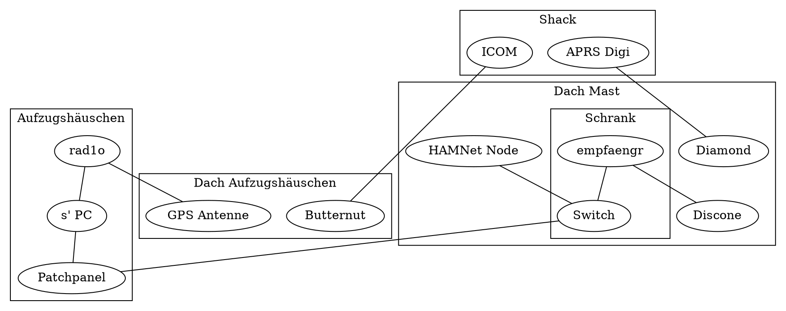

# DL0MUC

## Logische Ansicht, Stand 23.03.2018

```graphviz
    graph {
        splines=line;

        subgraph cluster_dach_mast {
            label="Dach Mast";
            node [label="Diamond"] ant_diamond;
            node [label="Discone"] ant_discone;
            node [label="HAMNet Node"] ant_hamnet;

            subgraph cluster_schrank {
                label="Schrank";

                node [label="empfaengr"] empfaengr;
                node [label="Switch"] eth_switch_mast;
            }
        }

        subgraph cluster_dach_aufzugshaeuschen {
            label="Dach Aufzugshäuschen";

            node [label="Butternut"] ant_butternut;
            node [label="GPS Antenne"] ant_sat;
        }

        subgraph cluster_rack {
            label="Rack";
        }

        subgraph cluster_aufzug {
            label="Aufzugshäuschen";
            node [label="s' PC"] s_pc;
            node [label="rad1o"] rad1o;
            node [label="Patchpanel"] eth_patchpanel;
            rad1o -- s_pc;
        }

        subgraph cluster_shack {
            label="Shack";
            node [label="ICOM"] trx_icom;
            node [label="APRS Digi"] aprs_digi;
        }

        empfaengr -- ant_discone;

        trx_icom -- ant_butternut;
        aprs_digi -- ant_diamond;
        rad1o -- ant_sat;
        ant_hamnet -- eth_switch_mast;
        empfaengr -- eth_switch_mast;

        s_pc -- eth_patchpanel;
        eth_switch_mast -- eth_patchpanel;
    }
```